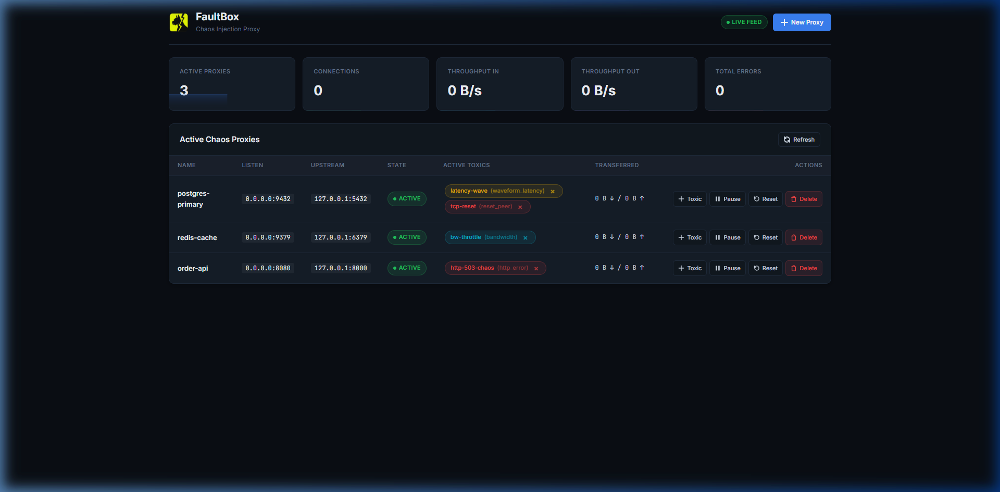
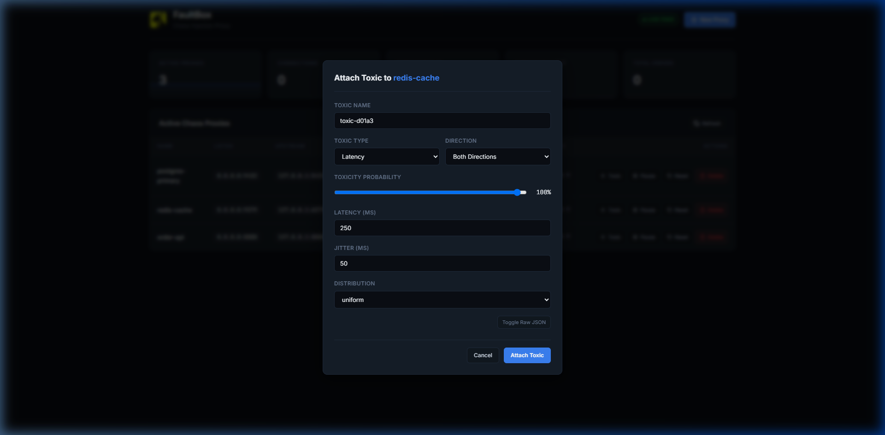
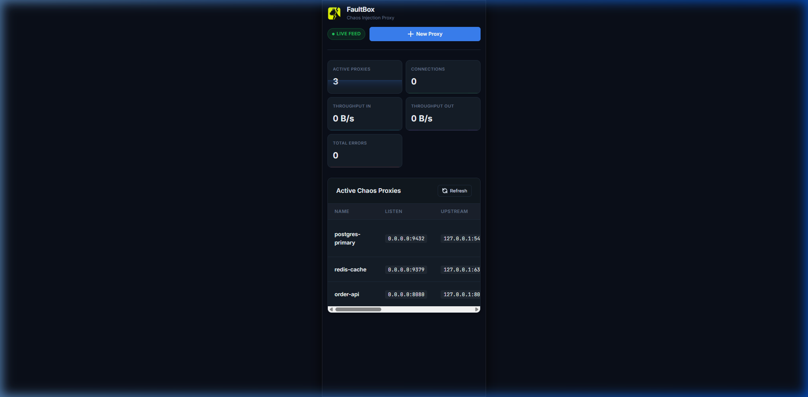

# Embedded Web UI Dashboard

FaultBox includes an embedded single-page browser dashboard served directly by the FastAPI control plane. It provides real-time cluster traffic telemetry with sparkline charts, proxy controls, and interactive toxic management without installing extra dependencies.

## Accessing the Dashboard

When FaultBox is running with the control plane enabled:

```bash
faultbox run --proxy "redis:9000->127.0.0.1:6379" --api --api-port 8474
```

Open your web browser and navigate to:

```
http://127.0.0.1:8474/
```

Or:

```
http://127.0.0.1:8474/ui
```

<p align="center">
  
</p>

## Features

### 1. Cluster Traffic KPIs with Sparkline Charts
The top metric cards aggregate cluster-wide statistics in real time, each with a live sparkline chart tracking the last 40 data points:
- **Active Proxies**: Total count of registered proxy listening routes.
- **Connections**: Total open TCP sockets currently transferring data.
- **Throughput In / Out**: Real-time throughput rates with automatic unit formatting (B/s, KB/s, MB/s).
- **Total Errors**: Cumulative count of socket resets and upstream connection failures.

### 2. Live Telemetry Streaming
The dashboard establishes a WebSocket connection to `/ws/telemetry` upon loading. Proxy states, throughput figures, and toxic badges refresh every second. If WebSockets are blocked or disconnected, the dashboard reconnects automatically with exponential backoff (up to 30 seconds between retries). Connection status is shown via the Live Feed badge in the header.

### 3. Interactive Proxy Management
- **New Proxy**: Create proxy listening routes by specifying name, local port, and upstream destination.
- **Pause / Resume**: Freeze socket acceptance without terminating the FaultBox process.
- **Reset**: Remove all active toxics on a proxy with a confirmation dialog to restore pristine conditions.
- **Delete**: Shut down and unregister proxies dynamically with a safety confirmation.

### 4. Direct Toxic Injection with Dynamic Forms
Click **+ Toxic** on any proxy to open the toxic attachment modal:
- Choose from all eleven toxic plugins, organized by category:
  - **Latency & Delay**: Latency, Waveform Latency
  - **Throughput & Throttling**: Bandwidth Throttle, Timeout / Hang
  - **Connection Disruption**: Reset Peer (TCP RST), Flapping Connection
  - **Data Corruption**: Byte Corruption, Packet Slicer
  - **Protocol Errors**: HTTP Error Status, gRPC Fault, TLS / SSL Fault
- Configure target direction (`inbound`, `outbound`, or `both`).
- Adjust toxicity probability with an interactive slider (0% to 100%).
- Dynamic form fields generated per toxic type with intuitive controls (number inputs, dropdowns, text fields) instead of raw JSON editing.
- Advanced users can toggle raw JSON editing for direct attribute manipulation.
- Individual toxics display color-coded badges based on their category and can be removed directly from the proxy row.

<p align="center">
  
</p>

### 5. Visual Design & Multi-Device Responsiveness
- Premium dark theme with Inter and JetBrains Mono typography.
- Semantic color-coded toxic badges: yellow for latency, cyan for throughput, red for destructive errors, purple for corruption, orange for behavioral faults.
- Toast notifications for all operations (replaces browser-native alerts).
- Confirmation dialogs for destructive actions (delete proxy, reset toxics).
- **Adaptive Single-Row Actions**: Action buttons stay strictly on a single horizontal row (`flex-wrap: nowrap`) with tooltips on hover. Below 1350px viewport width (laptops and tablets), labels seamlessly collapse into compact icon-only buttons (`+ Toxic`, `Pause/Resume`, `Reset`, `Delete`), preventing awkward line wrapping.
- **Multi-Device Adaptability**: Fully responsive grid layout across mobile smartphones, tablets, laptops, and ultra-wide displays. KPI cards adapt smoothly (2-column balanced grid on mobile), table enables smooth touch scrolling with a customized scrollbar, and modals fit comfortably within any viewport height.

<p align="center">
  
</p>
